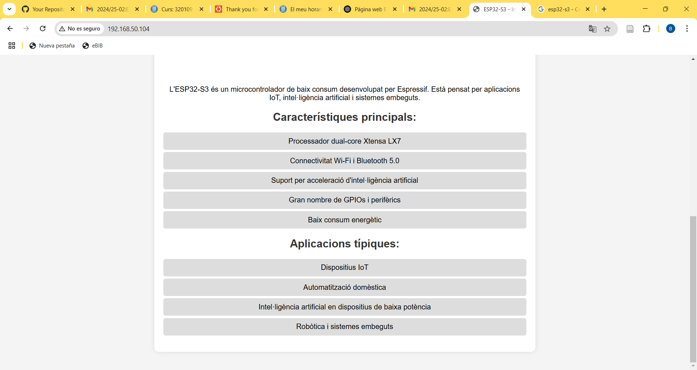
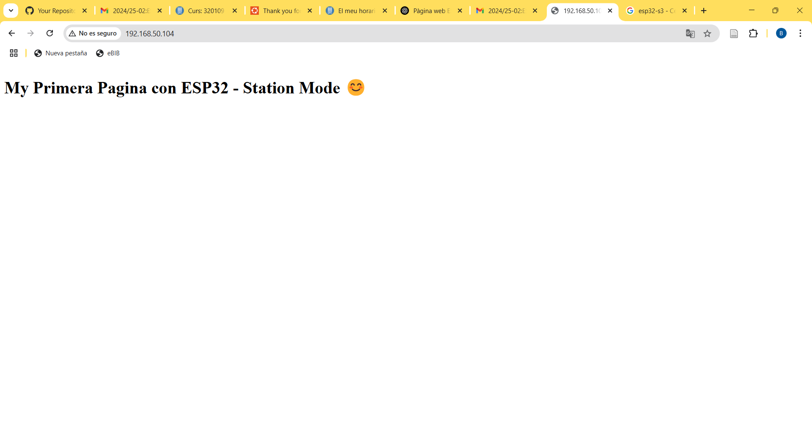

# PRACTICA 3 : WIFI  y BLUETOOTH  

El objetivo de la practica es comprender el funcionamiento de WIFI Y BT.

Para lo cual realizaremos una practica  donde  generaremos un web server desde utilizando 
nuestra ESP32.

## Practica A generación de una pagina web  


### - Cabezera
En la cabezera se declaran las librerias necesarias que en este caso son las librerias de <Wifi.h>, para gestionar la conexion wifi y <WebServer.h> para crear servidores web y gestionar las peticiones. Se declaran dos variables para introducir el SSID y el pasword de la red wifi a la que se quiere conectar el microcontrolador. Tambien declaramos un objeto **server** que serà el encargado de gestionar las peticiones. A demàs declaramos un string que contendrà el codigo HTML del contenido de la web y la funcion **handle_root** que responde a las peticiones de la pagina web.

 ```
#include <WiFi.h>
#include <WebServer.h>

// SSID & Password
const char* ssid = "*****";  // Enter your SSID here
const char* password = "*****";  //Enter your Password here

WebServer server(80);  // Object of WebServer(HTTP port, 80 is defult)

// HTML & CSS contents which display on web server
String HTML = "<!DOCTYPE html>\
<html>\
<body>\
<h1>My Primera Pagina con ESP32 - Station Mode &#128522;</h1>\
</body>\
</html>";

// Handle root url (/)
void handle_root() {
  server.send(200, "text/html", HTML);
}
```

### - Setup
En el setup se establece la velocidad de transmission, se inicia la conexion wifi y muestra la ip assignada a la **esp32**. Tambien se configura y inicia el servidor web.

```
void setup() {
  Serial.begin(115200);
  Serial.println("Try Connecting to ");
  Serial.println(ssid);

  // Connect to your wi-fi modem
  WiFi.begin(ssid, password);

  // Check wi-fi is connected to wi-fi network
  while (WiFi.status() != WL_CONNECTED) {
  delay(1000);
  Serial.print(".");
  }
  Serial.println("");
  Serial.println("WiFi connected successfully");
  Serial.print("Got IP: ");
  Serial.println(WiFi.localIP());  //Show ESP32 IP on serial

  server.on("/", handle_root);

  server.begin();
  Serial.println("HTTP server started");
  delay(100); 
}
```

### - Loop
En el loop solamente se llama la funcion **handleClient** encargada de gestionar las peticiones HTTPS y ejecuta la funcion asociada **handle_root**.
```
void loop() {
  server.handleClient();
}
```

Esta es la pagina web que se nos muestra.


## Ejercicios de mejora de nota 

1. Realizar el mismo ejercicio Wifi pero en lugar de realizar la conexión STA hacer una conexión AP

### - Cabezera
La cabezera es igual que en el apartado anterior. La unica diferencia que hay en la cabezera con el anterior ejercicio es que las variables de ssid y pasword seran el nombre y la contraseña que se le dara a la esp32 actuando como router.

```
// HTML & CSS contents which display on web server
String HTML = "<!DOCTYPE html>\
<html>\
<body>\
<h1>My Primera Pagina con ESP32 - Conexio AP &#128522;</h1>\
</body>\
</html>";


// SSID & Password
const char* ssid = "esp32";  // Enter your SSID here
const char* password = "123456789";  //Enter your Password here

WebServer server(80);  // Object of WebServer(HTTP port, 80 is defult)

// Handle root url (/)
void handle_root() {
  server.send(200, "text/html", HTML);
}
```

### - Setup

Para empezar, en el setup, se inicializa el monitor serie. Se configura el modo wifi como punto de acceso AP. Se crea el punto de acceso, muestra la direccion ip de la esp32 y inicia el servidor.

```
  Serial.begin(115200);
  WiFi.mode(WIFI_AP);
  WiFi.softAP(ssid, password);        //Start Acces point mode
  while(!WiFi.softAP(ssid, password))
  {
  Serial.println(".");
    delay(100);
  }
  
  Serial.print("Iniciado AP ");
  Serial.println(ssid);
  Serial.print("IP address:\t");
  Serial.println(WiFi.softAPIP());

  server.on("/", handle_root);
  server.begin();
  Serial.println("HTTP server started");
  delay(100); 
```

### - Loop
El loop es igual que en el apartado anterior, llama la funcion **handleClient** que ejecuta la funcion asociada **handle_root**.

```
void loop() {
  server.handleClient();
}
```

Esta es la pagina web que se nos muestra entrando con conexion AP.
