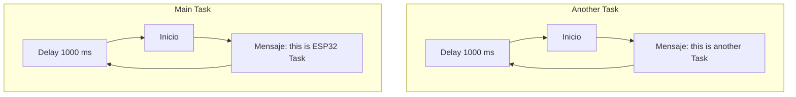
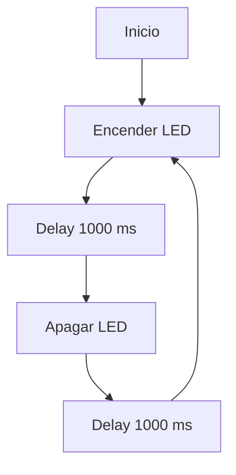
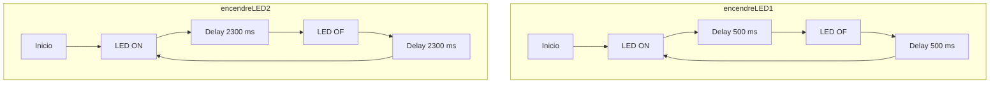

# PRACTICA 4 :  SISTEMAS OPERATIVOS EN TIEMPO REAL  
Biel Bernal Pratdesaba
## Pregunta teorica
Puede hacer los tres sincrónicamente, uno tras otro. Pero, ¿qué sucede si está utilizando una pantalla de tinta electrónica que tarda unos segundos en actualizarse? 

En este caso el microcontrolador quedará bloqueado mientras espera que la pantalla termine de actualizarse. Durante este periodo de bloqueo no se podran leer datos de los sensores. Esto puede provocar perdida de datos y retrasos en la comunicacion.

## Ejercicio Practico 1 

Este ejercicio no requiere ningun montaje previo.

### Setup
Para empezar, como de costumbre inicia el puerto serie y seguidamente inicializa la tarea con la funcion xTaskCreate.
```
void setup()
{
Serial.begin(112500);
/* we create a new task here */
xTaskCreate(
anotherTask, /* Task function. */
"another Task", /* name of task. */
10000, /* Stack size of task */
NULL, /* parameter of the task */
1, /* priority of the task */
NULL); /* Task handle to keep track of created task */
}
```
### Loop
EL loop en este caso és breve porquè la mayor parte de las funciones de este codigo las hacen las tareas. Solamente se envia un mensaje por el puerto serie que nos indica que se estarà mostrando el funcionamiento de la tarea principal.

```
/* the forever loop() function is invoked by Arduino ESP32 loopTask */
void loop()
{
Serial.println("this is ESP32 Task");
delay(1000);
}

```

### Definicion de la tarea
En esta parte del codigo se define la tarea que se llamara al iniciar el programa. La tarea consta de un bucle que nos muestra por el puerto serie que se està ejecuntando y un retardo de 1000 ms.

```
void anotherTask( void * parameter )
{
  // loop forever
  for(;;)
  {
    Serial.println("this is another Task");
    delay(1000);
  }
  // delete a task when finish,
  // this will never happen because this is infinity loop
  vTaskDelete( NULL );
}
```

En el puerto serie se pueden ver los dos mensajes que indican cuando empieza la tarea principal definida en el loop y la tarea que hemos definido, que se intercalan cada 1000 milisegundos: "this is ESP32 Task" y "this is another Task".

### Diagrama de flujos


Las tareas se ejecutan en paralelo.
## Ejercicio Practico 2

Este ejercicio requiere solamente de un díodo led conectado a al microprecesador.

### Cabecera
En la cabezera, se declara el numero del pin donde se va a conectar el díodo led y el semaforo binario. Tambien definimos las funciones que posteriormente llamaran las tareas, la primera para encender el led y la segunda para parar-lo.

```
const int led1 = 1;
SemaphoreHandle_t semafor;

void EncendreLED(void * parameter)
{
  while (true)
  {
    if (xSemaphoreTake(semafor, portMAX_DELAY)) // Agafa el semàfor
    {
      Serial.println("Encenent LED...");
      digitalWrite(led1, HIGH);
      vTaskDelay(500 / portTICK_PERIOD_MS);
      xSemaphoreGive(semafor); // Allibera el semàfor
    }
    vTaskDelay(100 / portTICK_PERIOD_MS); // Petita espera per evitar bloquejos
  }
}

void ApagarLED(void * parameter)
{
  while (true)
  {
    if (xSemaphoreTake(semafor, portMAX_DELAY)) // Agafa el semàfor
    {
      Serial.println("Apagant LED...");
      digitalWrite(led1, LOW);
      vTaskDelay(500 / portTICK_PERIOD_MS);
      xSemaphoreGive(semafor); // Allibera el semàfor
    }
    vTaskDelay(100 / portTICK_PERIOD_MS); // Petita espera per evitar bloquejos
  }
}
```
### Setup

En el setup se inicializa el puerto serie i el pin del led. Más tarde se crea el semàforo binario, se inicializa en estado disponible y se crean las tareas para encender el led y apagar-lo.
```
void setup()
{
  Serial.begin(115200);
  pinMode(led1, OUTPUT);

  semafor = xSemaphoreCreateBinary(); // Crear semàfor binari

  if (semafor != NULL) {
    xSemaphoreGive(semafor); // Inicialitzar-lo en estat disponible
  }

  xTaskCreate(
    EncendreLED,
    "Encendre LED",
    1000,
    NULL,
    1,
    NULL
  );

  xTaskCreate(
    ApagarLED,
    "Apagar LED",
    1000,
    NULL,
    1,
    NULL
  );
}
```
### Loop
Como las tareas se ejecutan constantmente en paralelo sin necessidad de llamar-las, el loop esta vacio.
```
void loop()
{
}
```

### Diagrama de flujos



## Ejercicio Propuesto
Hacer dos funciones que enciendan y apaguen dos LEDs diferentes con una frecuencia distinta.

### Cabecera
En la cabezera se se declara el numero de los pines de los dos leds. También se crean las dos funciones que van a utilizar cada tarea. La primera encendera y apagara un led con una frequencia de 500 ms y la segunda con una frequencia de 2300 ms.
```
const int led1 = 20;
const int led2 = 21;

void encendreLED1(void * parameter)
{
  // loop forever
  for(;;){ 
    // Turn the LED on
    digitalWrite(led1, HIGH);
    // Pause the task for 500ms
    vTaskDelay(500 / portTICK_PERIOD_MS);
    // Turn the LED off
    digitalWrite(led1, LOW);
    // Pause the task again for 500ms
    vTaskDelay(500 / portTICK_PERIOD_MS);
  }
}

void encendreLED2(void * parameter)
{
  // loop forever
  for(;;)
  {
    // Turn the LED on
    digitalWrite(led2, HIGH);  
    // Pause the task for 2300ms
    vTaskDelay(2300 / portTICK_PERIOD_MS);
    // Turn the LED off
    digitalWrite(led2, LOW);  
    // Pause the task again for 2300ms
    vTaskDelay(2300 / portTICK_PERIOD_MS);
  }
}
```
### Setup
Para empezar se inicializa el monitor serie. Seguidamente se configuran los pines de salida de los leds y para terminar se crean las tareas con sus respectivas funciones.
```
void setup()
{
  Serial.begin(115200);

  // Configurar els LEDs com a sortida
  pinMode(led1, OUTPUT);  // <-- AFEGIT
  pinMode(led2, OUTPUT);  // <-- AFEGIT

  xTaskCreate(
    encendreLED1, // Task function.
    "Encendre led f1", // name of task.
    10000, // Stack size of task
    NULL, // parameter of the task
    1, // priority of the task
    NULL); // Task handle to keep track of created task
  

  xTaskCreate(
    encendreLED2, // Task function.
    "Encendre led f2", // name of task.
    10000, // Stack size of task
    NULL, // parameter of the task
    1, // priority of the task
    NULL); // Task handle to keep track of created task
}
```
### Loop
Como las tareas se ejecutan en paralelo a la funcion principal, en este caso el loop esta vacio.
```
void loop()
{
  // No es fa res a loop() perquè les tasques s'executen en paral·lel
}
```
### Diagrama de flujos

