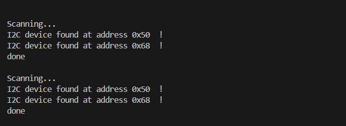

# PRACTICA 5 :  Buses de comunicación I (introducción y I2c)  

El objetivo de la practica es comprender el funcionamiento de los buses sistemas de comunicación entre periféricos;  estos elementos pueden ser internos o externos  al procesador.

## Ejercicio Practico 1  ESCÁNER I2C


### Setup
Para empezar, se inicializa el bus I2C y el puerto serie. El bus I2C se inicia con Wire.begin(), lo cual configura el ESP32 como maestro I2C utilizando los pines, en este caso por defecto, el pin 8 para SDA y el pin 9 para SCL. También inicializamos el puerto serie.
```
void setup()
{
  Wire.begin();
  Serial.begin(115200);
  while (!Serial);             // Leonardo: wait for serial monitor
  Serial.println("\nI2C Scanner");
}
```
### Loop
En este caso toda la funcionalidad la encontramos dentro del bucle loop(). Este bucle escanea todas las direcciones posibles del bus I2C (de 1 a 126) y muestra por el monitor serie cuáles han respondido correctamente, indicando que un dispositivo I2C está presente.
```
void loop()
{
  byte error, address;
  int nDevices;
 
  Serial.println("Scanning...");
 
  nDevices = 0;
  for(address = 1; address < 127; address++ )
  {
    // The i2c_scanner uses the return value of
    // the Write.endTransmisstion to see if
    // a device did acknowledge to the address.
    Wire.beginTransmission(address);
    error = Wire.endTransmission();
 
    if (error == 0)
    {
      Serial.print("I2C device found at address 0x");
      if (address<16)
        Serial.print("0");
      Serial.print(address,HEX);
      Serial.println("  !");
 
      nDevices++;
    }
    else if (error==4)
    {
      Serial.print("Unknown error at address 0x");
      if (address<16)
        Serial.print("0");
      Serial.println(address,HEX);
    }    
  }
  if (nDevices == 0)
    Serial.println("No I2C devices found\n");
  else
    Serial.println("done\n");
 
  delay(5000);           // wait 5 seconds for next scan
}
```
### Salida del puerto serie
En el puerto serie se puede ver el mensaje que aparece cada 5 segundos que te indica la direccion del dispositivo que està conectado. En el caso de que no haya ningun dispositivo conectado también lo indica.
