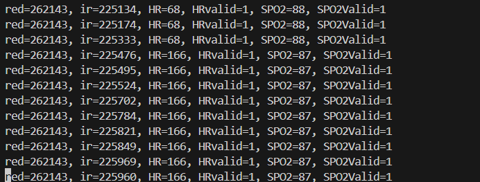

# PRACTICA 5 :  Buses de comunicación I (introducción y I2c)  

El objetivo de la practica es comprender el funcionamiento de los buses sistemas de comunicación entre periféricos;  estos elementos pueden ser internos o externos  al procesador.

## Ejercicio Practico 2   Sensor Max3012 medidor de oxigeno en sangre  y frecuencia cardiaca

### Cabezera
En esta sección se incluyen todas las librerías necesarias y la declaración de variables globales utilizadas a lo largo del programa. Estas configuraciones son fundamentales para la correcta lectura de datos desde el sensor y el procesamiento posterior.
```
#include <Arduino.h>
#include <Wire.h>
#include "MAX30105.h"
#include <Adafruit_I2CDevice.h> 
#include <Adafruit_GFX.h>
#include <Adafruit_SSD1306.h>

#include "spo2_algorithm.h"

MAX30105 particleSensor;

#define MAX_BRIGHTNESS 255

#if defined(__AVR_ATmega328P__) || defined(__AVR_ATmega168__)
//Arduino Uno doesn't have enough SRAM to store 100 samples of IR led data and red led data in 32-bit format
//To solve this problem, 16-bit MSB of the sampled data will be truncated. Samples become 16-bit data.
uint16_t irBuffer[100]; //infrared LED sensor data
uint16_t redBuffer[100];  //red LED sensor data
#else
uint32_t irBuffer[100]; //infrared LED sensor data
uint32_t redBuffer[100];  //red LED sensor data
#endif

int32_t bufferLength; //data length
int32_t spo2; //SPO2 value
int8_t validSPO2; //indicator to show if the SPO2 calculation is valid
int32_t heartRate; //heart rate value
int8_t validHeartRate; //indicator to show if the heart rate calculation is valid

byte pulseLED = 11; //Must be on PWM pin
byte readLED = 13; //Blinks with each data read
```

### Setup
En la función setup() se inicializa el puerto serie y las conexiones con el sensor. También se configuran diversos parámetros del sensor, como la intensidad de los LEDs, el modo de lectura, la tasa de muestreo, el ancho de pulso y el rango ADC.
```
void setup()
{
  Serial.begin(115200); // initialize serial communication at 115200 bits per second:

  pinMode(pulseLED, OUTPUT);
  pinMode(readLED, OUTPUT);

  // Initialize sensor
  if (!particleSensor.begin(Wire, I2C_SPEED_FAST)) //Use default I2C port, 400kHz speed
  {
    Serial.println(F("MAX30105 was not found. Please check wiring/power."));
    while (1);
  }

  Serial.println(F("Attach sensor to finger with rubber band. Press any key to start conversion"));
  while (Serial.available() == 0) ; //wait until user presses a key
  Serial.read();

  byte ledBrightness = 60; //Options: 0=Off to 255=50mA
  byte sampleAverage = 4; //Options: 1, 2, 4, 8, 16, 32
  byte ledMode = 2; //Options: 1 = Red only, 2 = Red + IR, 3 = Red + IR + Green
  byte sampleRate = 100; //Options: 50, 100, 200, 400, 800, 1000, 1600, 3200
  int pulseWidth = 411; //Options: 69, 118, 215, 411
  int adcRange = 4096; //Options: 2048, 4096, 8192, 16384

  particleSensor.setup(ledBrightness, sampleAverage, ledMode, sampleRate, pulseWidth, adcRange); //Configure sensor with these settings
}
```
### Loop
La función loop() se divide en dos fases:

Fase inicial: se adquieren 100 muestras para calcular los primeros valores de SpO2 y ritmo cardíaco.

Fase continua: se renuevan 25 muestras cada segundo, recalculando los resultados y mostrando los datos en cada iteración.
```
void loop()
{
  bufferLength = 100; //buffer length of 100 stores 4 seconds of samples running at 25sps

  //read the first 100 samples, and determine the signal range
  for (byte i = 0 ; i < bufferLength ; i++)
  {
    while (particleSensor.available() == false) //do we have new data?
      particleSensor.check(); //Check the sensor for new data

    redBuffer[i] = particleSensor.getRed();
    irBuffer[i] = particleSensor.getIR();
    particleSensor.nextSample(); //We're finished with this sample so move to next sample

    Serial.print(F("red="));
    Serial.print(redBuffer[i], DEC);
    Serial.print(F(", ir="));
    Serial.println(irBuffer[i], DEC);
  }

  //calculate heart rate and SpO2 after first 100 samples (first 4 seconds of samples)
  maxim_heart_rate_and_oxygen_saturation(irBuffer, bufferLength, redBuffer, &spo2, &validSPO2, &heartRate, &validHeartRate);

  //Continuously taking samples from MAX30102.  Heart rate and SpO2 are calculated every 1 second
  while (1)
  {
    //dumping the first 25 sets of samples in the memory and shift the last 75 sets of samples to the top
    for (byte i = 25; i < 100; i++)
    {
      redBuffer[i - 25] = redBuffer[i];
      irBuffer[i - 25] = irBuffer[i];
    }

    //take 25 sets of samples before calculating the heart rate.
    for (byte i = 75; i < 100; i++)
    {
      while (particleSensor.available() == false) //do we have new data?
        particleSensor.check(); //Check the sensor for new data

      digitalWrite(readLED, !digitalRead(readLED)); //Blink onboard LED with every data read

      redBuffer[i] = particleSensor.getRed();
      irBuffer[i] = particleSensor.getIR();
      particleSensor.nextSample(); //We're finished with this sample so move to next sample

      //send samples and calculation result to terminal program through UART
      Serial.print(F("red="));
      Serial.print(redBuffer[i], DEC);
      Serial.print(F(", ir="));
      Serial.print(irBuffer[i], DEC);

      Serial.print(F(", HR="));
      Serial.print(heartRate, DEC);

      Serial.print(F(", HRvalid="));
      Serial.print(validHeartRate, DEC);

      Serial.print(F(", SPO2="));
      Serial.print(spo2, DEC);

      Serial.print(F(", SPO2Valid="));
      Serial.println(validSPO2, DEC);
    }

    //After gathering 25 new samples recalculate HR and SP02
    maxim_heart_rate_and_oxygen_saturation(irBuffer, bufferLength, redBuffer, &spo2, &validSPO2, &heartRate, &validHeartRate);
  }
}
```
### Salida del puerto serie
Por el puerto serie aparece una secuencia de datos que permite observar en tiempo real el funcionamiento del sensor. En una primera fase, se muestran únicamente los valores brutos de las señales captadas por el sensor, es decir, la luz roja (red=...) y la luz infrarroja (ir=...), durante la adquisición de las primeras 100 muestras. Una vez finalizada esta fase, el programa entra en un bucle continuo donde, cada segundo, se actualizan y muestran por el puerto serie las nuevas lecturas junto con los valores calculados de frecuencia cardíaca (HR=...) y saturación de oxígeno (SPO2=...). Además, se incluyen indicadores de validez para ambos parámetros (HRvalid y SPO2Valid), que señalan si los cálculos han sido correctos (1) o no válidos (0). Estas salidas permiten al usuario monitorizar el estado de su pulso y oxigenación de forma continua y en tiempo real.
