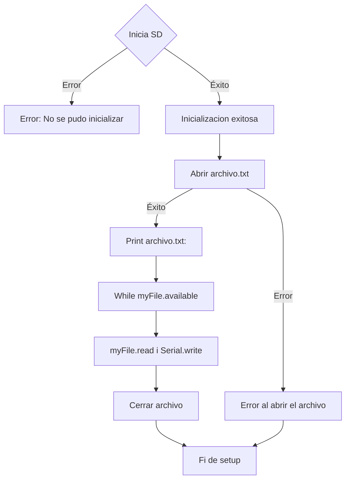

# PRACTICA 5 :  Buses de comunicación II (SPI)  

El objetivo de la practica es comprender el funcionamiento del bus spi 

## Ejercicio Practico 1  LECTURA/ESCRITURA  DE MEMORIA SD


### Cabezera
para empezar en la cabezera se indican las libreriasnecesarias, se define los pines de la conexion SPI , configura una conexion alternativa SPI1 y se declara la variable myfile para gestionar los archivos.
```
#include <Arduino.h>
#include <SPI.h>
#include <SD.h>

#define CS_PIN    5   // Opciones comunes: 5, 13, 21
#define SCK_PIN   12
#define MISO_PIN  13
#define MOSI_PIN  11

SPIClass spi = SPIClass(FSPI); // Usa SPI1 (FSPI)
File myFile;

```
### Setup 
En el setup, para empezar se inicializa el puerto serie. Se configuran i inicilizan los pines SPI. Inicializa una la conexion con la targeta SD con `SD.begin()` y en caso de fallo te da possibles causas del error. Lee el archivo con `SD.open()`, lo muestra por pantalla y cierra el archivo. En caso de error también lo notifica.
```
void setup() {
  Serial.begin(115200);
  delay(2000);

  // Configura SPI con los pines
  spi.begin(SCK_PIN, MISO_PIN, MOSI_PIN, CS_PIN);

  Serial.print("Iniciando SD... ");
  
  if (!SD.begin(CS_PIN, spi, 1000000)) { 
    Serial.println("Fallo. Verifica:");
    Serial.println("- Pines y conexiones");
    Serial.println("- Formato FAT32");
    Serial.println("- Resistencia pull-up");
    while (1);
  }
  Serial.println("Correcto");

  // Leer archivo...
  myFile = SD.open("/myFile.txt");
  if (myFile) {
    Serial.println("Contenido:");
    while (myFile.available()) {
      Serial.write(myFile.read());
    }
    myFile.close();
  } else {
    Serial.println("Error abriendo archivo");
  }
}
```
### Loop
Como este programa solo necesita inicializar y leer el archivo una vez, la funcion `loop()` està vacia.
```
void loop() {}
```
### Diagrama de bloqes 


### Salida puerto serie
Primero sale un mensaje que indica que se està inicando la conexion con la SD:
```
Iniciando SD... 
```
En caso de que la conexion se haya efectuado correctamente en el puerto serie se verà el contendio del archivo .txt:
```
Correcto
Contenido:
Hola món!
Aquest és un fitxer de prova.
```
si ha ocurrido un error con la conexion saldrà el siguiente mensaje:
```
Fallo. Verifica:
- Pines y conexiones
- Formato FAT32
- Resistencia pull-up
```
Si el error està en la  
```
Iniciando SD... 
Correcto
Error abriendo archivo
```


1. Descibir la salida por el puerto serie 
2. Explicar el funcionamiento 

