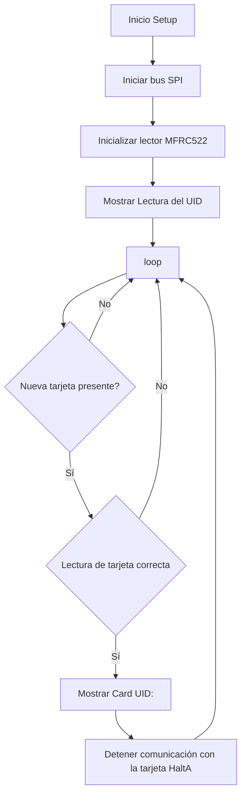

# PRACTICA 5 :  Buses de comunicación II (SPI)  

El objetivo de la practica es comprender el funcionamiento del bus spi.

## Ejercicio Practico 2 LECTURA DE ETIQUETA RFID 

### Cabezera
En la cabezera se llaman las librerias necessarias para las lecturas de las etiquetas RFID. En este caso solo se definen los pines de reset y de SDA porquè se usaran los pines predefinidos para la senyal de reloj SCK, el MISO y el MOSI. También se crea un objeto MFRC522 para poder controlar el lector MFRC522. 
```
#include <Arduino.h>
#include <SPI.h>
#include <MFRC522.h>

#define RST_PIN	9    //Pin 9 para el reset del RC522
#define SS_PIN	10   //Pin 10 para el SS (SDA) del RC522
MFRC522 mfrc522(SS_PIN, RST_PIN); 
```
### Setup 
En la funcion setup, se inicial la comunicacion con el puerto serie, el bus SPI con la funcion `SPI.begin()`, y el objeto MFC522 con la funcion `PCD_Init()`.
```
void setup() {
	Serial.begin(115200); //Iniciamos la comunicación  serial
	SPI.begin();        //Iniciamos el Bus SPI
	mfrc522.PCD_Init(); // Iniciamos  el MFRC522
	Serial.println("Lectura del UID");
}
```
### Loop
El codigo dentro de la funcion loop, utiliza la funcion `mfrc522.PICC_IsNewCardPresent()` para comprovar si hay una targeta disponible. En caso de que no haya ninguna tarjeta, el codigo cotinua comprovando. Si en caso contrario detecta una, passa a intentar leer su identificador UID con la funcion `mfrc522.PICC_ReadCardSerial()`. Cuando la lectura se realiza con exito se muestra por pantalla. Posteriormente se llama a la funcion `mfrc522.PICC_HaltA()` para finalizar la conexion con la tarjeta actual y seguir con la lectura de otras.
```
void loop() {
	// Revisamos si hay nuevas tarjetas  presentes
	if ( mfrc522.PICC_IsNewCardPresent()) 
        {  
  		//Seleccionamos una tarjeta
            if ( mfrc522.PICC_ReadCardSerial()) 
            {
                  // Enviamos serialemente su UID
                  Serial.print("Card UID:");
                  for (byte i = 0; i < mfrc522.uid.size; i++) {
                          Serial.print(mfrc522.uid.uidByte[i] < 0x10 ? " 0" : " ");
                          Serial.print(mfrc522.uid.uidByte[i], HEX);   
                  } 
                  Serial.println();
                  // Terminamos la lectura de la tarjeta  actual
                  mfrc522.PICC_HaltA();         
            }      
	}	
}
```
### Diagrama de bloques

### Salida puerto serie
Justo al iniciar la comunicacion saldrà el siguiente mensaje:
```
Lectura del UID
```
En el caso de que no detecte ninguna tarjeta, no aparecerà nada por el puerto serie. 
En canvio cuando detecte una targeta saldra el siguente mensaje con el UID de la tarjeta:
```
Card UID: xx xx xx xx
```
