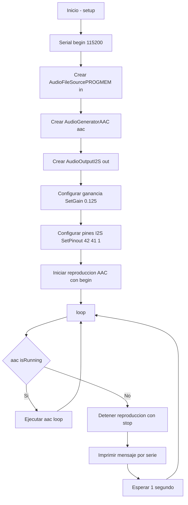

# PRACTICA 7 :  Buses de comunicación III (I2S)  

El objetivo de la practica actual es describir el funcionamiento del bus I2S y realizar una practica para comprender su  funcionamiento 

## Ejercicio Practico 1  reproducción desde memoria interna


Los datos de sonido se almacenan como una matriz en la RAM interna del ESP32. Usamos la placa de conexión de audio MAX98357 I2S para decodificar la señal digital en una señal analógica. Por lo tanto, utilizamos el protocolo I2S para generar los datos de sonido digital sin pérdidas de calidad.

La siguiente imagen muestra el cableado entre el ESP32 NodeMCU, la placa de conexión de audio MAX98357 I2S y el altavoz.


### Cabezera
En la cabezera se indican las librerias necesarias para el programa. En este caso utilizaremos las librerias habituales de arduino y librerias de audio de arduino. Tambien se definen las variables necesarias para la reproduccion del audio. La variable `in` para la fuebte del fitchero d'audio, la variable aac para el generador i la variable out per la salida I2C.
```c
#include <Arduino.h>
#include "AudioGeneratorAAC.h"
#include "AudioOutputI2S.h"
#include "AudioFileSourcePROGMEM.h"
#include "sampleaac.h"

AudioFileSourcePROGMEM *in;
AudioGeneratorAAC *aac;
AudioOutputI2S *out;
```
### Setup
Para enpezar en el setup, inicializamos el puerto serie. Crea un nuevo objeto `AudioFileSourcePROGMEM` como fuente de entrada. Crea un objeto `AudioGeneratorAAC`para el generador encargado de decodificar el audio y otro objeto `AudioOutputI2S` para la salida I2S. Tambien se ajusta la ganancia y se configura los pines de slaida. Para terminar con el setup, inicia la reproduccion. 
```c
void setup(){
  Serial.begin(115200);

  in = new AudioFileSourcePROGMEM(sampleaac, sizeof(sampleaac));
  aac = new AudioGeneratorAAC();
  out = new AudioOutputI2S();
  out -> SetGain(0.125);
  out->SetPinout(42, 41, 1);  // BCLK, LRCK, DOUT
  aac->begin(in, out);
}
```
### Loop
En el loop hay un bucle que comprueva si la reproduccion esta activa o no. En caso afrimativo el programa procesa la siguiente parte del audio, en caso contrario para la reproduccion.
```c
void loop(){
  if (aac->isRunning()) {
    aac->loop();
  } else {
    aac -> stop();
    Serial.printf("Sound Generator\n");
    delay(1000);
  }
}
```
### Diagrama de bloques

### Salida por el puerto serie
Por el puerto serie solamente se vería el siguiente mensaje cada vez que se acaba de reproducir el audio
```
Sound Generator
Sound Generator
Sound Generator
Sound Generator
```