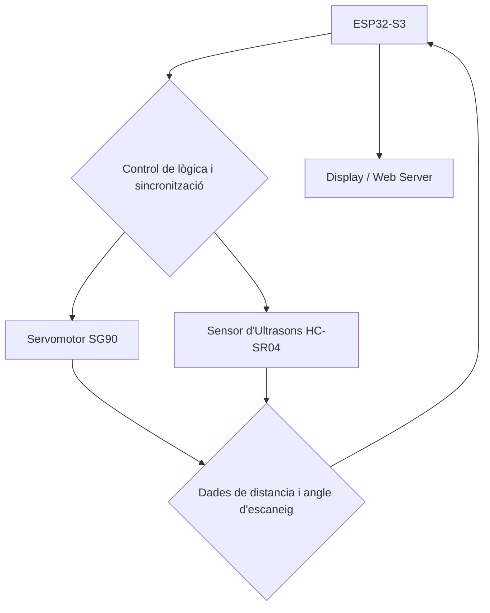

# Sistema de Radar Ultrasònic amb Escaneig Servo-Controlat

## Introduccio
L'objectiu d'aquest projecte és constriuri un radar funcional en petita escala utilitzant un modul sensor d'ultrasons per Arduino que canvii el seu angle i represntrar les dades en un display o en una pagina web. 

## Materials i preus:

- Micronontrolador ESP32-S3 
- [Mòdul sensor Ultrasonic HC-SR04](https://es.aliexpress.com/item/1005006356823811.html?spm=a2g0o.tesla.0.0.6808XYVfXYVfkl&pdp_npi=4%40dis%21EUR%217%2C33%E2%82%AC%213%2C89%E2%82%AC%21%21%21%21%21%402103985c17466247728195094eb10e%2112000036874195080%21btf%21%21%21&afTraceInfo=1005006356823811__pc__c_ppc_item_bridge_pc_main__7cu4ZRu__1746624772904&gatewayAdapt=glo2esp) (1,96€)
- [Servomotor Arduino](https://es.aliexpress.com/item/1005007442852333.html?spm=a2g0o.productlist.main.1.f5bbVrRRVrRRUz&algo_pvid=b2de79dc-fcd4-4243-b87f-31ac2074d2a0&algo_exp_id=b2de79dc-fcd4-4243-b87f-31ac2074d2a0-0&pdp_ext_f=%7B%22order%22%3A%221213%22%2C%22eval%22%3A%221%22%7D&pdp_npi=4%40dis%21EUR%217.52%211.98%21%21%2160.09%2115.83%21%402103849717466252133254860ef7eb%2112000040901170987%21sea%21ES%210%21ABX&curPageLogUid=1UdDTYtVtJBO&utparam-url=scene%3Asearch%7Cquery_from%3A) (1,47€)
- [Display](https://es.aliexpress.com/item/1005007176955358.html?spm=a2g0o.productlist.main.53.3435mbv9mbv9Qt&algo_pvid=99fef9c3-6b14-4d45-a5c7-f849cfc89786&algo_exp_id=99fef9c3-6b14-4d45-a5c7-f849cfc89786-48&pdp_ext_f=%7B%22order%22%3A%2247%22%2C%22eval%22%3A%221%22%7D&pdp_npi=4%40dis%21EUR%213.83%210.99%21%21%2130.37%217.87%21%40210385db17477615871275921e5d59%2112000039709060163%21sea%21ES%216364420074%21ABX&curPageLogUid=5bERN4YDkuvw&utparam-url=scene%3Asearch%7Cquery_from%3A) (0,99€)

També hi ha la opció de utilitzar un mòdul LIDAR que faría el matieix però permetria detectar objectes més petits en un rang similar però amb un preu més elevat.
- [Mòdul de Sensor de rang laser](https://es.aliexpress.com/item/1005006922414022.html?spm=a2g0o.tesla.0.0.2d57unhhunhhml&pdp_npi=4%40dis%21EUR%213%2C70%E2%82%AC%211%2C90%E2%82%AC%21%21%21%21%21%40211b430817466256264894352ed942%2112000038734773436%21btf%21%21%21&afTraceInfo=1005006922414022__pc__c_ppc_item_bridge_pc_related_wf__5RgBY2z__1746625626804&gatewayAdapt=glo2esp) (2,08€)
- [Cables](https://es.aliexpress.com/item/1005005501503609.html?spm=a2g0o.productlist.main.1.28731659oUviNF&algo_pvid=8be6c614-ddb9-40eb-85cf-4d0e754b9284&algo_exp_id=8be6c614-ddb9-40eb-85cf-4d0e754b9284-0&pdp_ext_f=%7B%22order%22%3A%228828%22%2C%22eval%22%3A%221%22%7D&pdp_npi=4%40dis%21EUR%211.26%210.99%21%21%211.39%211.09%21%40211b612517467185541565082ef116%2112000033328892977%21sea%21ES%210%21ABX&curPageLogUid=krbZPmegOtzx&utparam-url=scene%3Asearch%7Cquery_from%3A&_gl=1*12o4ek6*_gcl_aw*R0NMLjE3NDY3MTg1NTUuRUFJYUlRb2JDaE1JbjhDODFwbVVqUU1WeDA5QkFoMk9sQUkzRUFBWUFTQUFFZ0tSS2ZEX0J3RQ..*_gcl_dc*R0NMLjE3NDY2MjU2MzkuQ2p3S0NBandpZXpBQmhCWkVpd0FFYlRQR0RBa0tva0Qtb3dVQWFxVWNFQzMtTnpiVVBZbkViaGhGdnFibVFjcTV5bzNsZG1wa1I2WGtCb0MxM2NRQXZEX0J3RQ..*_gcl_au*MTA3NzcyMzY0MS4xNzQ2NjI0NzMz*_ga*MTI4MTIxNjk5MC4xNzA4NTA4NTY0*_ga_VED1YSGNC7*czE3NDY3MTg1NTQkbzgkZzAkdDE3NDY3MTg1NTQkajYwJGwwJGgw) (0,99€)

Total= 6,50€
## Diagrama de Blocs


## Descripció del codi

El sensor HC-SR04 envia una ona ultrasònica quan rep un pols al pin Trig i mesura el temps que triga l'ona a rebotar i tornar cap al sensor. Aquest temps es llegeix pel pin Echo.
La distància es calcula amb la fórmula següent:
$$
\text{Distància (cm)} = \frac{\text{temps}\cdot 0.0343}{2}=\frac{\text{temps (µs)}}{58.0}
$$
Aquesta constant prové de dividir el temps total entre l’anada i tornada (2 vegades la distància) i el fet que el so viatja a 343 m/s (o 0,0343 cm/µs). La funció getDistance() encapsula aquesta lògica.

Per el moviment del sensor, el servo SG90 es fa servir per girar el sensor HC-SR04 entre 15° i 165°. Aquest interval evita les zones extremes del moviment del servo on pot ser menys precís.
La funció actualitzaRadar(int angle) ajusta el servo amb radarServo.write(angle) i espera uns mil·lisegons perquè el moviment es completi abans de mesurar.

En cada angle escanejat, la distància es desa en un array (distancias[]). Aquest array es manté durant múltiples cicles per simular un radar amb traça persistent: es dibuixen totes les línies dels valors mesurats encara que ja no siguin l’últim valor capturat.
Això es veu tant al display com a la pàgina web (array traces[] a JavaScript).

Es fa servir la biblioteca U8g2 per representar gràficament els valors capturats. El radar es dibuixa mitjançant:
- Cercles concèntrics per indicar el radi (distància).
- Línies fixes per referències angulars (45°, 90°, 135°)
- Línies radials per cada angle mesurat, calculades en coordenades polars.
$$
x = \text{centre}_x + r \cdot \cos(\theta)
$$

$$
y = \text{centre}_y - r \cdot \sin(\theta)
$$

La pàgina web genera una interfície gràfica similar a un radar.
Els valors d’angle i distància es transmeten en temps real mitjançant WebSocket (implementat amb ESPAsyncWebServer i AsyncWebSocket). Cada vegada que es mesura una nova distància, el dispositiu envia un missatge JSON amb aquesta informació.
```
String json = "{\"angle\":" + String(angle) + ",\"distance\":" + String(distance, 1) + "}";
ws.textAll(json);
```
Es defineixen funcions de suport per:
- Convertir entre índex i angle (angleToIndex, indexToAngle)
- Mapejar l’angle a posicions X/Y en pantalla.
- Limitar la distància màxima visualitzada a 100 cm.

## Conexions
### Sensor Ultrasonic HC-SR04

| Pin del HC-SR04 | Connexió al ESP32-S3    |
| --------------- | ------------------------|
| **VCC**         | **5V**                  |
| **GND**         | **GND**                 |
| **Trig**        | **GPIO 12**             |
| **Echo**        | **GPIO 13**             |


### Servomotor SG90
| Cable Servo | Connexió ESP32-S3                     |
| ----------- | ------------------------------------- |
| **GND**     | GND(marró)                            |
| **VCC**     | 5V (si suportat) o 3.3V (vermell)     |
| **Signal**  | GPIO 5 (groc)                         |


### Display SH1106
| Cable Display | Connexió ESP32-S3                  |
| ------------- | ---------------------------------- |
| **GND**       | GND                                |
| **VCC**       | 3.3V (o 5V si el mòdul ho suporta) |
| **SCL**       | GPIO 2                             |
| **SDA**       | GPIO 1                             |


## Control de versions
### Versió 1(punt radar):
```
#include <Arduino.h>
#include <Wire.h>
#include <U8g2lib.h>
#include <ESP32Servo.h>

// Inicialitza el display SH1106 (128x64, I2C, sense pin reset)
U8G2_SH1106_128X64_NONAME_F_HW_I2C display(U8G2_R0, /* reset=*/ U8X8_PIN_NONE);

// Pins
const int Trigger = 10;
const int Echo = 11;
const int ServoPin = 5;

Servo radarServo;

float getDistance();
void actualitzaRadar(int angle);

// Mapeig d'angle (15°–165°) a pantalla (20–108)
int mapAngleToX(int angle) {
  return map(angle, 15, 165, 20, 108);
}

// Mapeig de distància a radi (centre cap avall)
int mapDistanceToY(float distance) {
  if (distance < 0) return 63;
  distance = constrain(distance, 0, 100);
  return 63 - map(distance, 0, 100, 0, 60);
}

void setup() {
  Serial.begin(115200);

  pinMode(Trigger, OUTPUT);
  pinMode(Echo, INPUT);
  digitalWrite(Trigger, LOW);

  radarServo.setPeriodHertz(50);
  radarServo.attach(ServoPin, 500, 2400);

  Wire.begin(8, 9);  // Pins SDA i SCL personalitzats

  display.begin();
  display.clearBuffer();
  display.setFont(u8g2_font_ncenB08_tr);
  display.drawStr(10, 30, "Iniciant Radar...");
  display.sendBuffer();
  delay(1000);
}

void loop() {
  for (int angle = 15; angle <= 165; angle += 2) {
    actualitzaRadar(angle);
  }
  for (int angle = 165; angle >= 15; angle -= 2) {
    actualitzaRadar(angle);
  }
}

void actualitzaRadar(int angle) {
  radarServo.write(angle);
  delay(60); // estabilització

  delay(30);  // <– nova línia: deixa reposar el sensor abans de mesurar

  float distance = getDistance();

  Serial.print("Angle: ");
  Serial.print(angle);
  Serial.print("°, Distància: ");
  Serial.print(distance);
  Serial.println(" cm");

  // Dibuix a pantalla
  display.clearBuffer();

  // Línies de referència
  display.drawLine(64, 63, 64, 0); // vertical
  display.drawLine(0, 63, 127, 63); // base horitzontal
  display.drawLine(64, 63, 64 + 42, 63 - 42); // 45°
  display.drawLine(64, 63, 64 - 42, 63 - 42); // 135°

  // Cercles de distància
  for (int r = 10; r <= 60; r += 10) {
    display.drawCircle(64, 63, r);
  }

  // Punt mesura
  int x = constrain(mapAngleToX(angle), 0, 127);
  int y = constrain(mapDistanceToY(distance), 0, 63);
  display.drawDisc(x, y, 2);  // punt del radar

  // Text
  display.setFont(u8g2_font_5x7_tr);
  display.setCursor(0, 10);
  display.print("Angle: ");
  display.print(angle);
  display.print(" deg");

  display.setCursor(0, 20);
  display.print("Dist: ");
  display.print(distance, 0);
  display.print(" cm");

  display.sendBuffer();
  delay(50);
}

float getDistance() {
  digitalWrite(Trigger, LOW);
  delayMicroseconds(2);
  digitalWrite(Trigger, HIGH);
  delayMicroseconds(10);
  digitalWrite(Trigger, LOW);

  long duration = pulseIn(Echo, HIGH, 30000);
  if (duration == 0) return -1;
  return duration / 58.0;
}
```

### Versio 2(traça persistent)
```
#include <Arduino.h>
#include <Wire.h>
#include <U8g2lib.h>
#include <ESP32Servo.h>

// Inicialitza el display SH1106
U8G2_SH1106_128X64_NONAME_F_HW_I2C display(U8G2_R0, /* reset=*/ U8X8_PIN_NONE);

// Pins
const int Trigger = 10;
const int Echo = 11;
const int ServoPin = 5;

Servo radarServo;

float getDistance();
void actualitzaRadar(int angle);

// Mapeig d'angle (15°–165°) a pantalla (20–108)
int mapAngleToX(int angle) {
  return map(angle, 15, 165, 20, 108);
}

// Mapeig de distància a radi (centre cap avall)
int mapDistanceToY(float distance) {
  if (distance < 0) return 63;
  distance = constrain(distance, 0, 100);
  return 63 - map(distance, 0, 100, 0, 60);
}

// Variables per la traça persistent
#define NUM_ANGLES 76  // (165 - 15) / 2 + 1
float distancias[NUM_ANGLES];  // distàncies per cada angle

#define RADAR_CX 64
#define RADAR_CY 63
#define MAX_RADIUS 60

float degToRad(int deg) {
  return deg * PI / 180.0;
}


int angleToIndex(int angle) {
  return (angle - 15) / 2;
}

int indexToAngle(int index) {
  return index * 2 + 15;
}

void setup() {
  Serial.begin(115200);

  pinMode(Trigger, OUTPUT);
  pinMode(Echo, INPUT);
  digitalWrite(Trigger, LOW);

  radarServo.setPeriodHertz(50);
  radarServo.attach(ServoPin, 500, 2400);

  Wire.begin(8, 9);  // Pins SDA i SCL del Display

  display.begin();
  display.clearBuffer();
  display.setFont(u8g2_font_ncenB08_tr);
  display.drawStr(10, 30, "Iniciant Radar...");
  display.sendBuffer();
  delay(1000);

  // Inicialitzar array de distàncies
  for (int i = 0; i < NUM_ANGLES; i++) {
    distancias[i] = -1;
  }
}

void loop() {
  for (int angle = 15; angle <= 165; angle += 2) {
    actualitzaRadar(angle);
  }
  for (int angle = 165; angle >= 15; angle -= 2) {
    actualitzaRadar(angle);
  }
}

void actualitzaRadar(int angle) {
  radarServo.write(angle);
  delay(60);  // estabilització servo

  float distance = getDistance();

  Serial.print("Angle: ");
  Serial.print(angle);
  Serial.print("°, Distància: ");
  Serial.print(distance);
  Serial.println(" cm");

  // Desa la distància
  int idx = angleToIndex(angle);
  if (idx >= 0 && idx < NUM_ANGLES) {
    distancias[idx] = distance;
  }

  // Dibuix
  display.clearBuffer();

  // Línies de referència
  display.drawLine(64, 63, 64, 0); // 90°
  display.drawLine(0, 63, 127, 63); // horitzontal
  display.drawLine(64, 63, 64 + 42, 63 - 42); // 45°
  display.drawLine(64, 63, 64 - 42, 63 - 42); // 135°
  for (int r = 10; r <= 60; r += 10) {
    display.drawCircle(64, 63, r);
  }

 // Dibuixar línies de traça amb coordenades polars reals
for (int i = 0; i < NUM_ANGLES; i++) {
  float d = distancias[i];
  if (d > 0) {
    int a = indexToAngle(i);
    float angleRad = degToRad(a);
    float radius = constrain(map(d, 0, 100, 0, MAX_RADIUS), 0, MAX_RADIUS);
    int x = RADAR_CX + radius * cos(angleRad);
    int y = RADAR_CY - radius * sin(angleRad);
    display.drawLine(RADAR_CX, RADAR_CY, x, y);
  }
}

  // Text
  display.setFont(u8g2_font_5x7_tr);
  display.setCursor(0, 10);
  display.print("Angle: ");
  display.print(angle);
  display.print(" deg");

  display.setCursor(0, 20);
  display.print("Dist: ");
  display.print(distance, 0);
  display.print(" cm");

  display.sendBuffer();
  delay(40);
}

float getDistance() {
  digitalWrite(Trigger, LOW);
  delayMicroseconds(2);
  digitalWrite(Trigger, HIGH);
  delayMicroseconds(10);
  digitalWrite(Trigger, LOW);

  long duration = pulseIn(Echo, HIGH, 30000);
  if (duration == 0) return -1;
  return duration / 58.0;
}

```

### Versió 3(conexió wifi i servidor web basic)

```
#include <Arduino.h>
#include <Wire.h>
#include <U8g2lib.h>
#include <ESP32Servo.h>

#include <WiFi.h>
#include <AsyncTCP.h>
#include <ESPAsyncWebServer.h>

// Inicialitza el display SH1106
U8G2_SH1106_128X64_NONAME_F_HW_I2C display(U8G2_R0, /* reset=*/ U8X8_PIN_NONE);

// Pins
const int Trigger = 12;
const int Echo = 13;
const int ServoPin = 5;

Servo radarServo;

float getDistance();
void actualitzaRadar(int angle);

// SSID i pasword
const char* ssid = "MiFibra-85F0";
const char* password = "ecLs7rJd";

AsyncWebServer server(80);
AsyncWebSocket ws("/ws");

void setupWifi() {
  WiFi.setSleep(false);
  WiFi.begin(ssid, password);
  Serial.print("Connectant a WiFi...");
  while (WiFi.status() != WL_CONNECTED) {
    delay(500);
    Serial.print(".");
  }
  Serial.println();
  Serial.print("Connectat! IP: ");
  Serial.println(WiFi.localIP());
}

void onWsEvent(AsyncWebSocket *server, AsyncWebSocketClient *client,
               AwsEventType type, void *arg, uint8_t *data, size_t len) {
  if (type == WS_EVT_CONNECT) {
    Serial.printf("[WS] Client connectat: #%u\n", client->id());
  } else if (type == WS_EVT_DISCONNECT) {
    Serial.printf("[WS] Client desconnectat: #%u\n", client->id());
  }
}

void setupServer() {
  server.on("/", HTTP_GET, [](AsyncWebServerRequest *request){
    request->send(200, "text/html", "<h2>Radar ESP32</h2><p>Pàgina web integrada correctament!</p>");
  });
  ws.onEvent(onWsEvent);
  server.addHandler(&ws);
  server.begin();
}

// Mapeig d'angle (15°–165°) a pantalla (20–108)
int mapAngleToX(int angle) {
  return map(angle, 15, 165, 20, 108);
}

// Mapeig de distància a radi (centre cap avall)
int mapDistanceToY(float distance) {
  if (distance < 0) return 63;
  distance = constrain(distance, 0, 100);
  return 63 - map(distance, 0, 100, 0, 60);
}

// Variables per la traça persistent
#define NUM_ANGLES 76  // (165 - 15) / 2 + 1
float distancias[NUM_ANGLES];  // distàncies per cada angle

#define RADAR_CX 64
#define RADAR_CY 63
#define MAX_RADIUS 60

float degToRad(int deg) {
  return deg * PI / 180.0;
}


int angleToIndex(int angle) {
  return (angle - 15) / 2;
}

int indexToAngle(int index) {
  return index * 2 + 15;
}

void setup() {
  Serial.begin(115200);

  pinMode(Trigger, OUTPUT);
  pinMode(Echo, INPUT);
  digitalWrite(Trigger, LOW);

  radarServo.setPeriodHertz(50);
  radarServo.attach(ServoPin, 500, 2400);

  Wire.begin(1, 2);  // Pins SDA i SCL del Display

  display.begin();
  display.clearBuffer();
  display.setFont(u8g2_font_ncenB08_tr);
  display.drawStr(10, 30, "Iniciant Radar...");
  display.sendBuffer();
  delay(1000);

  // Inicialitzar array de distàncies
  for (int i = 0; i < NUM_ANGLES; i++) {
    distancias[i] = -1;
  }

  // Inicalitzem la conexió wifi
  setupWifi();
  setupServer();
}

void loop() {
  for (int angle = 15; angle <= 165; angle += 2) {
    actualitzaRadar(angle);
  }
  for (int angle = 165; angle >= 15; angle -= 2) {
    actualitzaRadar(angle);
  }
}

void actualitzaRadar(int angle) {
  radarServo.write(angle);
  delay(60);  // estabilització servo

  float distance = getDistance();

  Serial.print("Angle: ");
  Serial.print(angle);
  Serial.print("°, Distància: ");
  Serial.print(distance);
  Serial.println(" cm");

  // Desa la distància
  int idx = angleToIndex(angle);
  if (idx >= 0 && idx < NUM_ANGLES) {
    distancias[idx] = distance;
  }

  // Dibuix
  display.clearBuffer();

  // Línies de referència
  display.drawLine(64, 63, 64, 0); // 90°
  display.drawLine(0, 63, 127, 63); // horitzontal
  display.drawLine(64, 63, 64 + 42, 63 - 42); // 45°
  display.drawLine(64, 63, 64 - 42, 63 - 42); // 135°
  for (int r = 10; r <= 60; r += 10) {
    display.drawCircle(64, 63, r);
  }

 // Dibuixar línies de traça amb coordenades polars reals
for (int i = 0; i < NUM_ANGLES; i++) {
  float d = distancias[i];
  if (d > 0) {
    int a = indexToAngle(i);
    float angleRad = degToRad(a);
    float radius = constrain(map(d, 0, 100, 0, MAX_RADIUS), 0, MAX_RADIUS);
    int x = RADAR_CX + radius * cos(angleRad);
    int y = RADAR_CY - radius * sin(angleRad);
    display.drawLine(RADAR_CX, RADAR_CY, x, y);
  }
}

  // Text
  display.setFont(u8g2_font_5x7_tr);
  display.setCursor(0, 10);
  display.print("Angle: ");
  display.print(angle);
  display.print(" deg");

  display.setCursor(0, 20);
  display.print("Dist: ");
  display.print(distance, 0);
  display.print(" cm");

  display.sendBuffer();
  delay(40);
}

float getDistance() {
  digitalWrite(Trigger, LOW);
  delayMicroseconds(2);
  digitalWrite(Trigger, HIGH);
  delayMicroseconds(10);
  digitalWrite(Trigger, LOW);

  long duration = pulseIn(Echo, HIGH, 30000);
  if (duration == 0) return -1;
  return duration / 58.0;
}
```

### Versió 4(servidor web amb dades per pantalla)
```
#include <Arduino.h>
#include <Wire.h>
#include <U8g2lib.h>
#include <ESP32Servo.h>

#include <WiFi.h>
#include <AsyncTCP.h>
#include <ESPAsyncWebServer.h>

// Inicialitza el display SH1106
U8G2_SH1106_128X64_NONAME_F_HW_I2C display(U8G2_R0, /* reset=*/ U8X8_PIN_NONE);

// Pins
const int Trigger = 12;
const int Echo = 13;
const int ServoPin = 5;

Servo radarServo;

float getDistance();
void actualitzaRadar(int angle);

// SSID i pasword
const char* ssid = "Nautilus";
const char* password = "20000Leguas";

AsyncWebServer server(80);
AsyncWebSocket ws("/ws");

void setupWifi() {
  WiFi.setSleep(false);
  WiFi.begin(ssid, password);
  Serial.print("Connectant a WiFi...");
  while (WiFi.status() != WL_CONNECTED) {
    delay(500);
    Serial.print(".");
  }
  Serial.println();
  Serial.print("Connectat! IP: ");
  Serial.println(WiFi.localIP());
}

void onWsEvent(AsyncWebSocket *server, AsyncWebSocketClient *client,
               AwsEventType type, void *arg, uint8_t *data, size_t len) {
  if (type == WS_EVT_CONNECT) {
    Serial.printf("[WS] Client connectat: #%u\n", client->id());
  } else if (type == WS_EVT_DISCONNECT) {
    Serial.printf("[WS] Client desconnectat: #%u\n", client->id());
  }
}

const char index_html[] PROGMEM = R"rawliteral(
<!DOCTYPE html>
<html>
<head>
  <meta charset="UTF-8">
  <title>Radar ESP32</title>
  <style>
    body {
      font-family: sans-serif;
      background: #111;
      color: #0f0;
      text-align: center;
    }
    canvas {
      background: #000;
      border: 1px solid #0f0;
      margin-top: 20px;
    }
    #info {
      margin-top: 10px;
      font-size: 18px;
    }
  </style>
</head>
<body>
  <h1>Radar ESP32</h1>
  <canvas id="radarCanvas" width="400" height="400"></canvas>
  <div id="info">
    <p><strong>Angle:</strong> <span id="angle">--</span>°</p>
    <p><strong>Distància:</strong> <span id="distance">--</span> cm</p>
  </div>
  <script>
    const canvas = document.getElementById("radarCanvas");
    const ctx = canvas.getContext("2d");
    const centerX = canvas.width / 2;
    const centerY = canvas.height;
    const maxRadius = 300;
    let traces = new Array(76).fill(null);

    function degToRad(deg) {
      return deg * Math.PI / 180;
    }

    function drawRadar() {
      ctx.clearRect(0, 0, canvas.width, canvas.height);

      // Fons i cercles
      ctx.strokeStyle = "#0f0";
      ctx.lineWidth = 1;
      for (let r = 60; r <= maxRadius; r += 60) {
        ctx.beginPath();
        ctx.arc(centerX, centerY, r, Math.PI, 2 * Math.PI);
        ctx.stroke();
      }

      // Línies angulars
      [15, 45, 90, 135, 165].forEach(angle => {
        const rad = degToRad(angle);
        const x = centerX + maxRadius * Math.cos(rad);
        const y = centerY - maxRadius * Math.sin(rad);
        ctx.beginPath();
        ctx.moveTo(centerX, centerY);
        ctx.lineTo(x, y);
        ctx.stroke();
      });

      // Dibuixar traça
      ctx.strokeStyle = "#0ff";
      traces.forEach((d, i) => {
        if (d !== null) {
          const angle = 15 + i * 2;
          const rad = degToRad(angle);
          const radius = Math.min((d / 100) * maxRadius, maxRadius);
          const x = centerX + radius * Math.cos(rad);
          const y = centerY - radius * Math.sin(rad);
          ctx.beginPath();
          ctx.moveTo(centerX, centerY);
          ctx.lineTo(x, y);
          ctx.stroke();
        }
      });
    }

    function updateRadar(angle, distance) {
      const index = Math.floor((angle - 15) / 2);
      if (index >= 0 && index < traces.length) {
        traces[index] = distance;
      }
      document.getElementById("angle").textContent = angle;
      document.getElementById("distance").textContent = distance.toFixed(1);
      drawRadar();
    }

    // Connexió WebSocket
    const protocol = location.protocol === "https:" ? "wss" : "ws";
    const socket = new WebSocket(protocol + "://" + location.host + "/ws");

    socket.onmessage = (event) => {
      const data = JSON.parse(event.data);
      updateRadar(data.angle, data.distance);
    };
  </script>
</body>
</html>
)rawliteral";

void setupServer() {
  server.on("/", HTTP_GET, [](AsyncWebServerRequest *request){
    request->send_P(200, "text/html", index_html);
  });
  ws.onEvent(onWsEvent);
  server.addHandler(&ws);
  server.begin();
}

// Mapeig d'angle (15°–165°) a pantalla (20–108)
int mapAngleToX(int angle) {
  return map(angle, 15, 165, 20, 108);
}

// Mapeig de distància a radi (centre cap avall)
int mapDistanceToY(float distance) {
  if (distance < 0) return 63;
  distance = constrain(distance, 0, 100);
  return 63 - map(distance, 0, 100, 0, 60);
}

// Variables per la traça persistent
#define NUM_ANGLES 76  // (165 - 15) / 2 + 1
float distancias[NUM_ANGLES];  // distàncies per cada angle

#define RADAR_CX 64
#define RADAR_CY 63
#define MAX_RADIUS 60

float degToRad(int deg) {
  return deg * PI / 180.0;
}


int angleToIndex(int angle) {
  return (angle - 15) / 2;
}

int indexToAngle(int index) {
  return index * 2 + 15;
}

void setup() {
  Serial.begin(115200);

  pinMode(Trigger, OUTPUT);
  pinMode(Echo, INPUT);
  digitalWrite(Trigger, LOW);

  radarServo.setPeriodHertz(50);
  radarServo.attach(ServoPin, 500, 2400);

  Wire.begin(1, 2);  // Pins SDA i SCL del Display

  display.begin();
  display.clearBuffer();
  display.setFont(u8g2_font_ncenB08_tr);
  display.drawStr(10, 30, "Iniciant Radar...");
  display.sendBuffer();
  delay(1000);

  // Inicialitzar array de distàncies
  for (int i = 0; i < NUM_ANGLES; i++) {
    distancias[i] = -1;
  }

  // Inicalitzem la conexió wifi
  setupWifi();
  setupServer();
}

void loop() {
  for (int angle = 15; angle <= 165; angle += 2) {
    actualitzaRadar(angle);
  }
  for (int angle = 165; angle >= 15; angle -= 2) {
    actualitzaRadar(angle);
  }
}

void actualitzaRadar(int angle) {
  radarServo.write(angle);
  delay(30);  // estabilització servo

  float distance = getDistance();

  Serial.print("Angle: ");
  Serial.print(angle);
  Serial.print("°, Distància: ");
  Serial.print(distance);
  Serial.println(" cm");

  // Desa la distància
  int idx = angleToIndex(angle);
  if (idx >= 0 && idx < NUM_ANGLES) {
    distancias[idx] = distance;
  }

  // Dibuix
  display.clearBuffer();

  // Línies de referència
  display.drawLine(64, 63, 64, 0); // 90°
  display.drawLine(0, 63, 127, 63); // horitzontal
  display.drawLine(64, 63, 64 + 42, 63 - 42); // 45°
  display.drawLine(64, 63, 64 - 42, 63 - 42); // 135°
  for (int r = 10; r <= 60; r += 10) {
    display.drawCircle(64, 63, r);
  }

 // Dibuixar línies de traça amb coordenades polars reals
for (int i = 0; i < NUM_ANGLES; i++) {
  float d = distancias[i];
  if (d > 0) {
    int a = indexToAngle(i);
    float angleRad = degToRad(a);
    float radius = constrain(map(d, 0, 100, 0, MAX_RADIUS), 0, MAX_RADIUS);
    int x = RADAR_CX + radius * cos(angleRad);
    int y = RADAR_CY - radius * sin(angleRad);
    display.drawLine(RADAR_CX, RADAR_CY, x, y);
  }
}

  // Text
  display.setFont(u8g2_font_5x7_tr);
  display.setCursor(0, 10);
  display.print("Angle: ");
  display.print(angle);
  display.print(" deg");

  display.setCursor(0, 20);
  display.print("Dist: ");
  display.print(distance, 0);
  display.print(" cm");

  display.sendBuffer();
  delay(40);

  // Envia dades al WebSocket
  String json = "{\"angle\":" + String(angle) + ",\"distance\":" + String(distance, 1) + "}";
  ws.textAll(json);
}

float getDistance() {
  digitalWrite(Trigger, LOW);
  delayMicroseconds(2);
  digitalWrite(Trigger, HIGH);
  delayMicroseconds(10);
  digitalWrite(Trigger, LOW);

  long duration = pulseIn(Echo, HIGH, 30000);
  if (duration == 0) return -1;
  return duration / 58.0;
}
```
